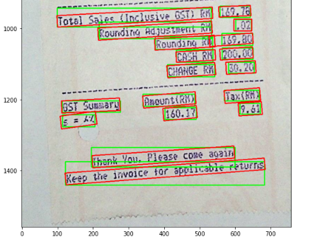
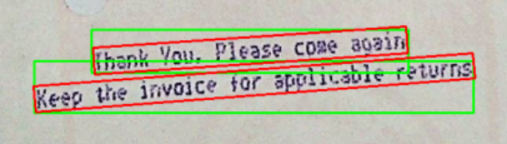
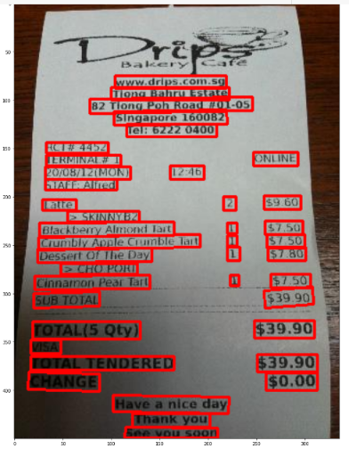

# ICDAR 2019 Robust Reading Challenge on Scanned Receipts Optical Character Recognition and Information Extraction

Shvets Sergey

The ICDAR 2019 Robust Reading Challenge on Scanned Receipts OCR and Information Extraction (SROIE) is a competition that was held as part of the 15th International Conference on Document Analysis and Recognition (ICDAR) in September 2019. The challenge aimed to encourage research on optical character recognition (OCR) and information extraction from scanned receipts, which are often challenging due to the variability in text layout, font, and quality. 

This attempt was undertaken during a five-day hackathon in January 2023 as part of the master's degree program at Ural Federal University. 

## Competition tasks

Link to original competition - [https://arxiv.org/pdf/2103.10213.pdf](https://arxiv.org/pdf/2103.10213.pdf)

SROIE represents the processeses of recognizing text from scanned receipts, extracting key texts from them and saving the extracted texts to structured documents.

The competition consisted of three tasks:
- Scanned receipt text localisation;
- Scanned receipt optical character recognition;
- Key information extraction from scanned receipts.

For **tasks 1 and 2**, each image in the dataset was required to be annotated with text bounding boxes (bbox) and the transcript of each text bbox. The locations were annotated as rectangles with four vertices, which were in clockwise order starting from the top. The annotations for an image were stored in a text file with the same file name. The file format was as following:

```
x1_1,y1_1,x2_1,y2_1,x3_1,y3_1,x4_1,y4_1,transcript_1
x1_2,y1_2,x2_2,y2_2,x3_2,y3_2,x4_2,y4_2,transcript_2
x1_3,y1_3,x2_3,y2_3,x3_3,y3_3,x4_3,y4_3,transcript_3
…
x1_N,y1_N,x2_N,y2_N,x3_N,y3_N,x4_N,y4_N,transcript_N
```
The aim of **task 3** is to extract texts of a number of key fields from given receipts, and save the texts for each receipt image in a JSON file. Each image in the dataset should be also annotated and stored with a text file with the following format:

```json
{
  "company": "STARBUCKS STORE #10208",
  "address": "11302 EUCLID AVENUE, CLEVELAND, OH (216) 229-0749",
  "date": "14/03/2015",
  "total": "4.95"
}
```

## Methods and Models

The main goal was to build a baseline code in a short time and achieve satisfactory results. Firstly, we developed a CPU version of the code, then optimized it to work on a GPU, resulting in a significant increase in speed. Further plans include applying methods for improving final metrics using transfer learning, NLTK, etc.

### Task 1, 2: PaddleOCR

For Tasks 1 and 2, we utilized an out-of-the-box solution with [PaddleOCR](https://github.com/PaddlePaddle/PaddleOCR) and achieved good results to begin with. The best results were obtained using `en_PP-OCRv3_rec` as the recognition model and `en_PP-OCRv3_det` as the detection model. We did not use the angle classifier, as no text was rotated by 180 degrees, and used cls=False to improve performance.

### Task 3: DonutProcessor

The Donut model was proposed in [OCR-free Document Understanding Transformer](https://arxiv.org/abs/2111.15664). Donut consists of an image transformer encoder and an autoregressive text Transformer decoder to perform document understanding tasks such as document image classification, form understanding, and visual question answering. An overview and code examples of the Donut model as a HuggingFace transformer are available [here](https://huggingface.co/docs/transformers/main/en/model_doc/donut).

A pretrained model [unstructuredio/donut-base-sroie](https://huggingface.co/unstructuredio/donut-base-sroie) was taken as a backbone

## Results

Mean Levenstein ratio on Task 1,2: **0.9337**

Mean Levenstein ratio on Task 3:   **0.9177**

For the text localization task, I calculated the [Intersection over Union index](https://en.wikipedia.org/wiki/Jaccard_index) (IoU) and obtained an average result of **0.8274**. Upon further examination of the index calculation, I noticed that all of the ground truth bounding boxes were rectangles without any slope. However, PaddleOCR produces rectangles with slope when the image is rotated. As shown in the example of the rotated image X51005268408.jpg from the test dataset, the red boxes represent predictions and the green boxes represent the ground truths. 



The IoU ratio uses only two vertices (upper left and lower right)

```
pred_box_df = pd.DataFrame(data=lines, columns=['x1', 'y1', 'x2', 'y2', 'x3', 'y3', 'x4', 'y4', 'text'])

pred_box_df['x'] = pred_box_df['x1'].astype(int)
pred_box_df['y'] = pred_box_df['y1'].astype(int)
pred_box_df['w'] = pred_box_df['x2'].astype(int) - pred_box_df['x1'].astype(int)
pred_box_df['h'] = pred_box_df['y3'].astype(int) - pred_box_df['y1'].astype(int)

pred_box_df = pred_box_df.drop(columns=['x1', 'y1', 'x2', 'y2', 'x3', 'y3', 'x4', 'y4'])

ap, mean_iou, mean_ratio = calculate_AP(gt_box_df, pred_box_df, iou_thr, lratio_thr)
```

Tail from ground truth `X51005268408.txt` file looks as following:

<pre>
...
196,<b>1335</b>,600,<b>1335</b>,600,<b>1390</b>,196,<b>1390</b>,THANK YOU. PLEASE COME AGAIN
<b>123</b>,1375,<b>683</b>,1375,<b>683</b>,1441,<b>123</b>,1441,KEEP THE INVOICE FOR APPLICABLE RETURNS
</pre>

It can be noticed that the X and Y values repeat each other, resulting in a zero slope of the rectangle.

In contrast, PaddleOCR yields angled rectangles with different eight coordinates, leading to very good OCR results. Therefore, we did not rely too much on the IoU ratio.

<pre>
198,1358,597,1331,599,1365,200,1392,IHANK VOU. PLEASE CONE AOAIN
122,1407,682,1365,685,1397,125,1440,KEEG THE INVOICE FAR SPALICEBLE RETURNS
</pre>

Enlarged lower section of `X51005268408.jpg` file:



## Demos

I have included demo blocks for each task in the source file. You can provide a URL link for any receipt (with English letters and numbers) and try it.

### Task 1: Scanned Receipt Text Localisation



### Task 2: Scanned Receipt OCR

```
['104', '75', '219', '75', '219', '88', '104', '88'] WWW.DRIPS.COM.SG
['100', '87', '222', '87', '222', '100', '100', '100'] TLONG BAHRU ESTATE
['78', '99', '246', '97', '246', '111', '78', '114'] 82 TIONG POH ROAD #01-05
['103', '112', '219', '110', '220', '125', '103', '126'] SINGAPORE 160082
['116', '125', '209', '125', '209', '138', '116', '138'] TEL:6222 0400
['33', '144', '97', '144', '97', '155', '33', '155'] RCT# 4452
['33', '157', '110', '157', '110', '168', '33', '168'] TERMINAL#I
['247', '154', '293', '154', '293', '168', '247', '168'] ONLINE
['32', '169', '120', '169', '120', '182', '32', '182'] 20/08/12(MON)
['161', '168', '196', '168', '196', '182', '161', '182'] 12-46
['32', '182', '106', '182', '106', '193', '32', '193'] STAFFALFRED
['29', '203', '64', '203', '64', '214', '29', '214'] LATTE
['216', '200', '229', '200', '229', '214', '216', '214'] 2
['258', '199', '296', '199', '296', '213', '258', '213'] $9.60
['55', '215', '129', '215', '129', '226', '55', '226']  SKINNYB2
['26', '227', '165', '226', '165', '240', '26', '241'] BLACKBERRY ALMOND TART
['220', '227', '230', '227', '230', '238', '220', '238'] 1
['259', '225', '298', '225', '298', '239', '259', '239'] $7.50
['25', '242', '192', '239', '192', '252', '25', '255'] CRUMBLY APPLE CRUMBLE TAIT
['220', '240', '230', '240', '230', '251', '220', '251'] 1
['261', '239', '300', '239', '300', '253', '261', '253'] $7.50
['24', '254', '142', '253', '142', '267', '24', '268'] DESSERT OF THE DAY
['220', '252', '233', '252', '233', '266', '220', '266'] 1
['262', '252', '301', '252', '301', '266', '262', '266'] $7.80
['48', '269', '127', '269', '127', '280', '48', '280'] >CHOPORT
['21', '282', '140', '281', '140', '295', '21', '296'] CINNAMON PEAR TART
['223', '281', '232', '281', '232', '292', '223', '292'] 1
['265', '280', '306', '280', '306', '294', '265', '294'] $7.50
['20', '300', '88', '298', '88', '313', '20', '315'] SUB TOTAL
['258', '297', '308', '293', '309', '311', '259', '315'] $39.90
['19', '329', '130', '329', '130', '347', '19', '347'] TOTAL(5 QTY)
['248', '328', '310', '328', '310', '346', '248', '346'] $39.90
['17', '348', '48', '348', '48', '362', '17', '362'] VISA
['17', '365', '165', '365', '165', '379', '17', '379'] TOTALTENDERED
['251', '363', '313', '363', '313', '381', '251', '381'] $39.90
['15', '381', '88', '383', '88', '401', '14', '399'] CHANGE
['260', '382', '313', '382', '313', '400', '260', '400'] $0.00
['102', '405', '222', '407', '221', '424', '102', '422'] HAVE A NICE DAY
['122', '424', '202', '424', '202', '438', '122', '438'] THANK YOU
['115', '438', '210', '439', '210', '449', '114', '449'] SEE VOU SOON
```

### Task 3: Key Information Extraction

```json
{
  "address": "82 TLONG POH ROAD #01-05 SINGAPORE 160082",
  "company": "BAKERY",
  "date": "20/08/12",
  "total": "$39.90"
}
```

Feel free to modify/improve this code, which is available for Google Colab/Jupyter Notebook with GPU support [here](./ICDAR_2019_SROIE.ipynb).
